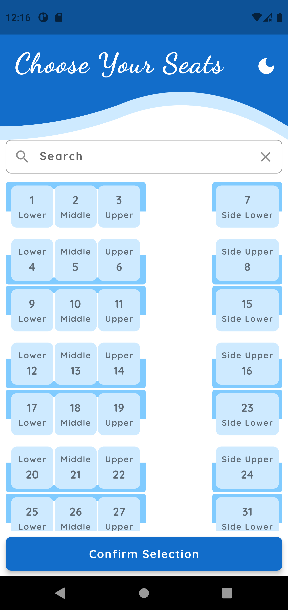
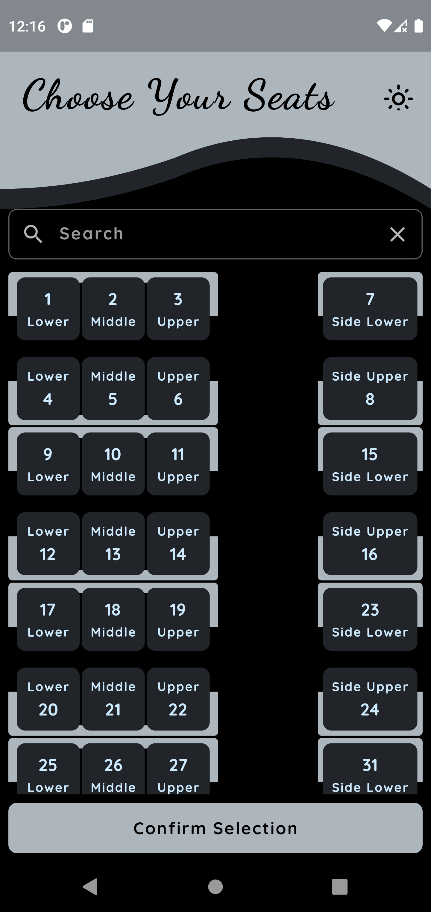
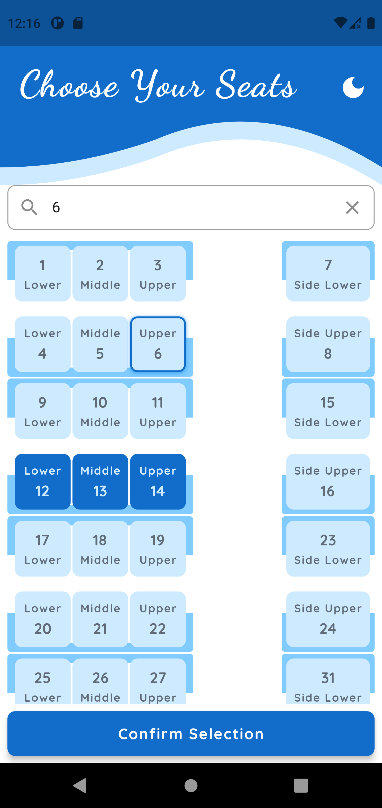
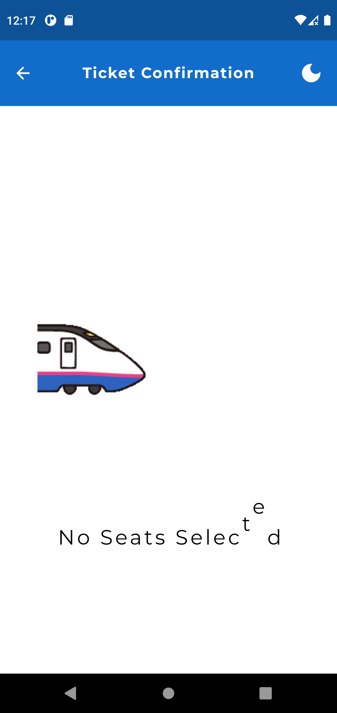
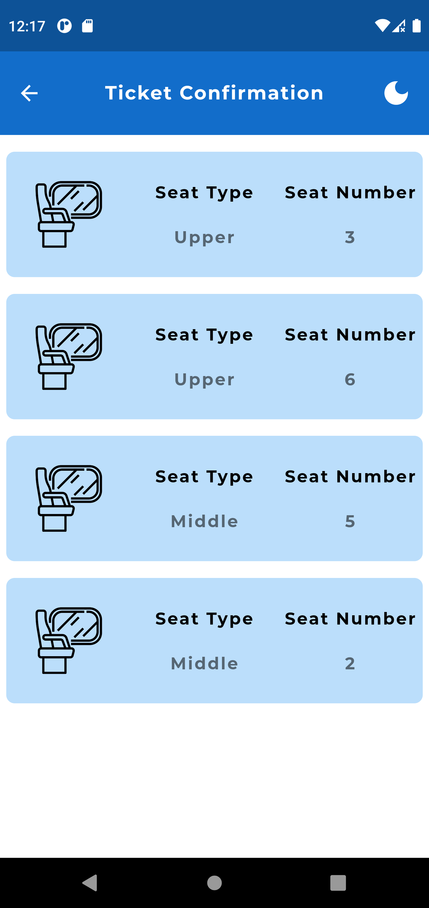
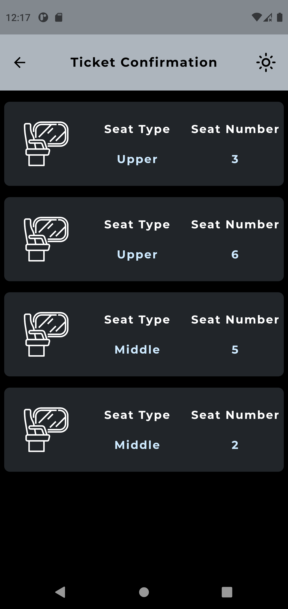

# Seat Picker UI Application - Flutter Intern Assignment

## Table of Contents
- Description
- Screen Recording
- Screenshots
- Features
- Technologies
- Getting Started
- Usage
- Responsive Design
- State Management

## Description
Welcome to the Seat Picker UI Application, a Flutter-based application developed as a technical assignment for the Flutter Intern position at CRUV. This app aims to provide a user-friendly interface for selecting seats in a train cabin and displaying the selected seats in a confirmation page.

The application utilizes the provider package for state management, ensuring an efficient and scalable approach to handling the application's state. With a responsive design achieved through flutter_screenutil, the app seamlessly adapts to different screen sizes and orientations.

## Screen Recording

https://github.com/Rhythm-Divine/Seat-Picker-UI/assets/81385160/9615996c-51a8-4d33-b1fb-644621086f5a

## Screenshots

 

 

## Features
- Seat Picking page with an intuitive UI for selecting seats in a train cabin.
- Search functionality allows users to find their desired seats by typing the seat number in the search bar.
- Confirmation page displays the selected seats for review.
- Light and Dark theme options for personalized user experience.
- User-friendly fonts for enhanced readability.
## Technologies
The Seat Picker UI Application is built using the following technologies and packages:

- Flutter Framework
- provider package for state management
- flutter_screenutil for responsive design

## Getting Started
To run the Seat Picker UI Application on your local machine, follow these steps:

- Ensure you have Flutter installed. If not, follow the instructions in the - Flutter documentation to install Flutter.
- Clone this repository to your local machine.
- Open the project in your favorite IDE or editor.
- Run flutter pub get to install the required dependencies.
- Connect a device or start an emulator.
- Run flutter run to launch the application.

## Usage
- On the Seat Picking page, you will see a train cabin with available seats.
- Tap on the seats you wish to select. The selected seats will be highlighted.
- Use the search bar to find specific seats by typing their seat numbers.
- Once you have selected the desired seats, navigate to the Confirmation page.
- The Confirmation page will display the seats you have selected for review.

## Responsive Design
The application is built with responsiveness in mind. Thanks to flutter_screenutil, the UI elements will automatically adapt to different screen sizes, ensuring a consistent and visually appealing experience across various devices.

## State Management
State management in the Seat Picker UI Application is handled efficiently using the provider package. This allows for seamless updates to the application's state, ensuring a smooth and responsive user experience.
